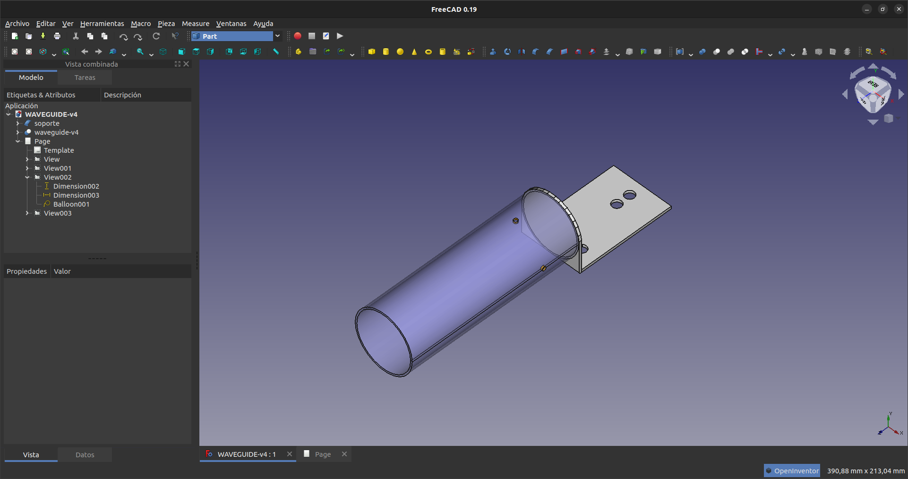
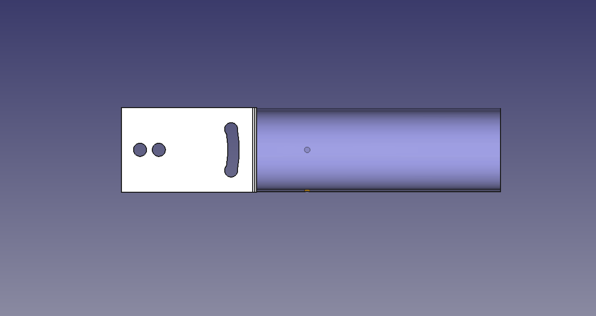
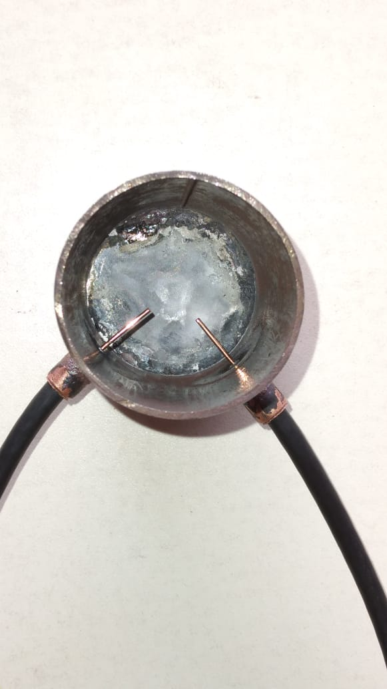
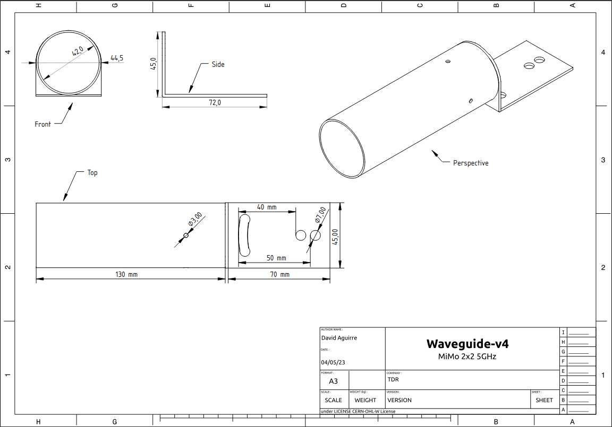

<!--
SPDX-FileCopyrightText: 2023 Tecnología de Raíz <tecnologiaderaiz@disroot.org>

SPDX-License-Identifier: CC-BY-NC-4.0
-->

#Sector antenna

## How to make the design of your sector antenna

We thank NlNet and Altermundi for making this project possible. 

From our reality, we try to create solutions for the development of Hardware in the territories, in an accessible way.

In the search for an antenna design with optimal gain, easily replicable , we return to the research work that AlterMundi began and sustained to estimate dimensions of the antenna, using a [Waveguide calculator](https://github.com/TecnologiadeRaiz/LoPALiR/blob/6cfcefe5b7c623523bdbc38a3de3d6f52c728e81/circular_waveguide_tuneado.ods), adapted for 5.8 GHz by Nicolás Echaniz

This is the foundation on which we build our production experiences and continue to expand research at TDR.

We work with a free drawing software program for the design of the antennas.

These are the results using [FreeCAD](https://www.freecadweb.org/downloads.php?lang=es_ES)

Waveguide and support.

As illuminator we use for each chain, a 11.7mm spike of 95/30 coaxial cable from Indeca and a RP-SMA Male connector at the other end.

We provide the plans to build these antennas.

Files in: <a href="https://github.com/TecnologiadeRaiz/LoPALiR">LoPALiR</a>

This project was funded through the <strong> <a href="https://nlnet.nl/useroperated/">User-Operated Internet</a> </strong> fund, a fund established by <a href="https://nlnet.nl">NLnet</a> made possible by financial support from the <a href="https://pkt.cash" rel="nofollow">PKT Community</a> <a href="https://pkt.cash/network-steward" rel="nofollow">The Network Steward</a> and stichting <a href="https://technologycommons.org">Technology Commons Trust</a>.
 

En cooperación con <a href="https://altermundi.net/">AlterMundi.</a>

