<!--
SPDX-FileCopyrightText: 2023 Tecnología de Raíz <tecnologiaderaiz@disroot.org>

SPDX-License-Identifier: CC-BY-NC-4.0
-->

# Directional antenna design

The present design aims to provide how to make a directional MiMo antenna for 5Ghz, capable of achieving a gain of 20dB to 25dB.

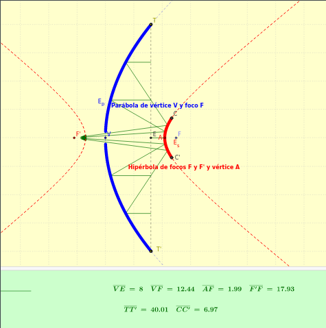

In this new iteration of the "Trompebolic" design, we used a 44mm waveguide with a reflector to illuminate the parabolic dish.
We used a 40cm diameter and 8cm high parabolic dish as a mould, calculating the focus at 12.5cm from the centre.

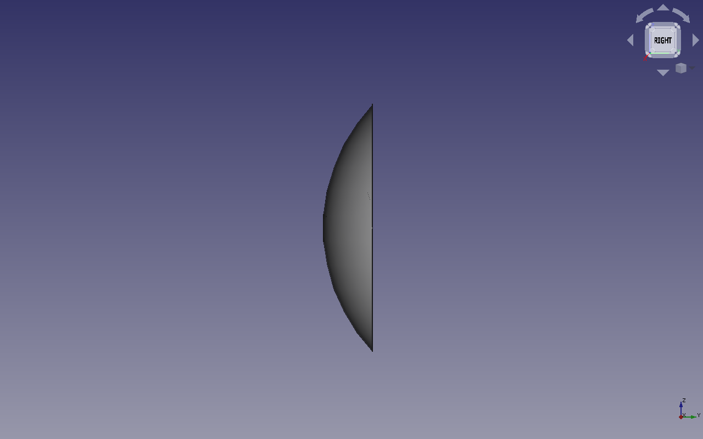
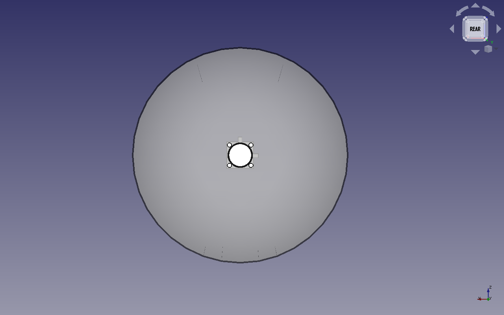

### Reflector.

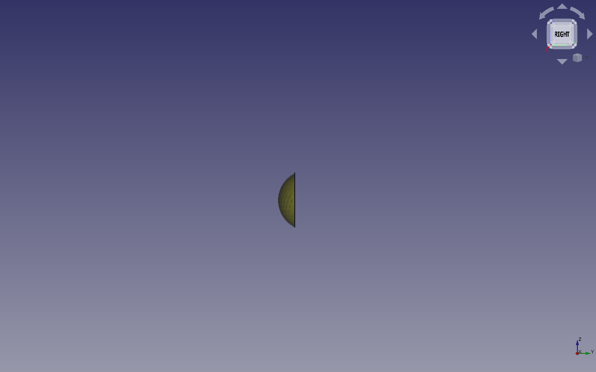

### Parabola support and handles.

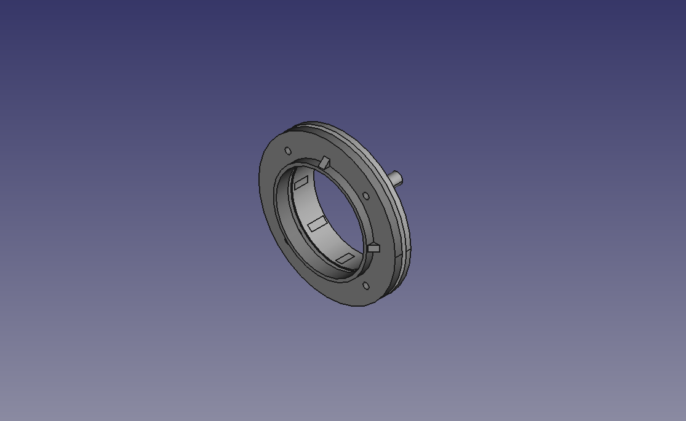

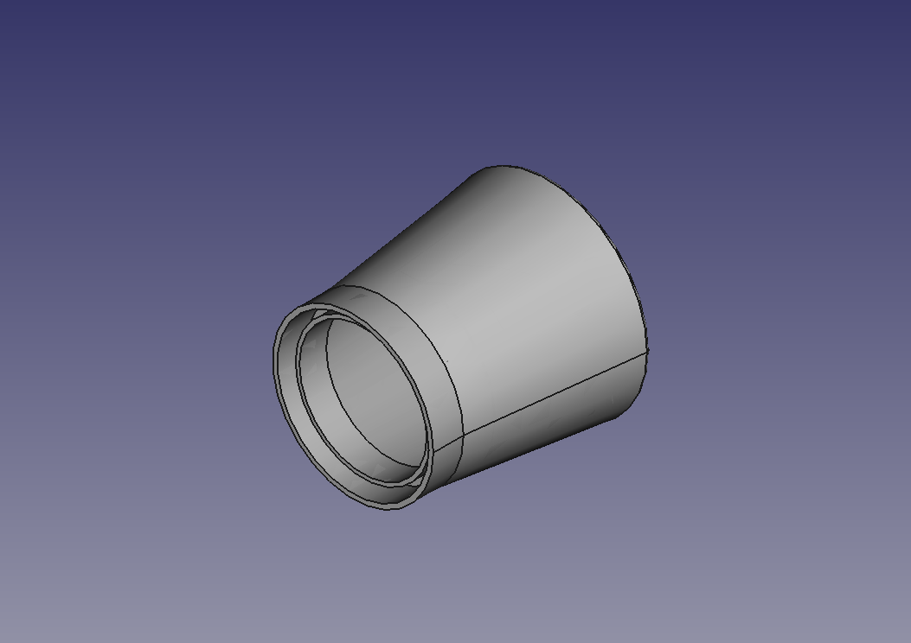
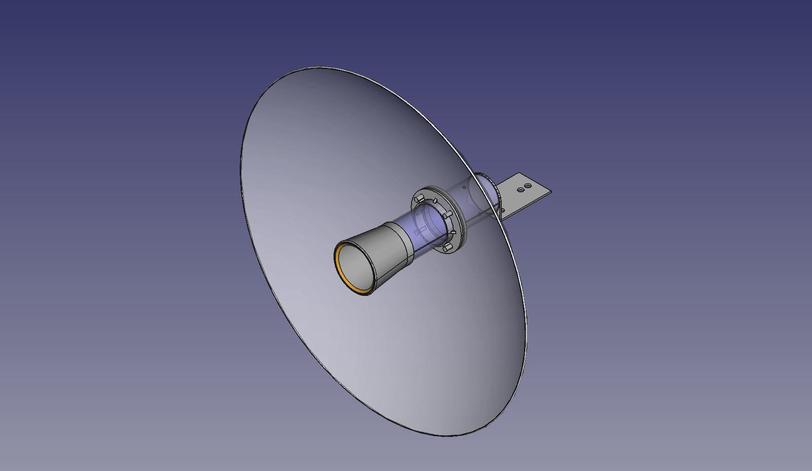

### Final design.

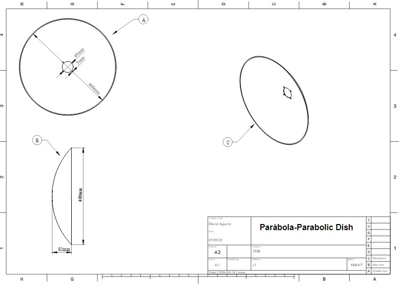
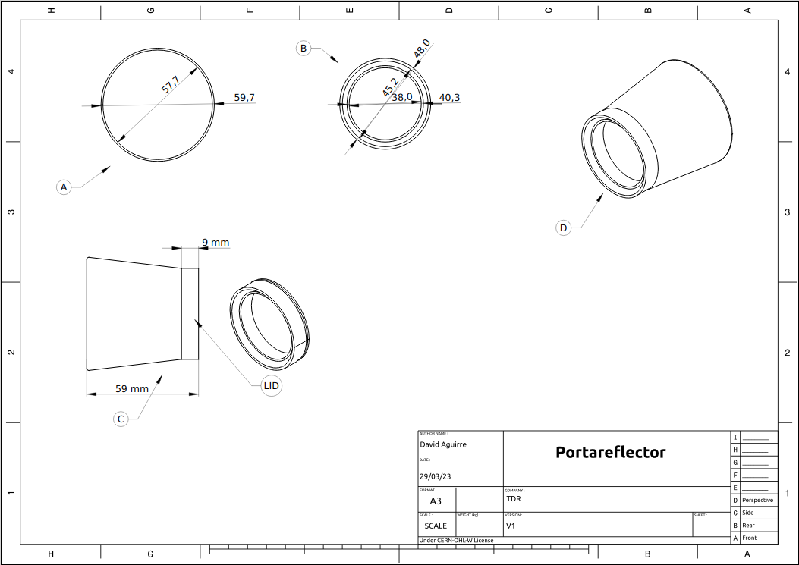
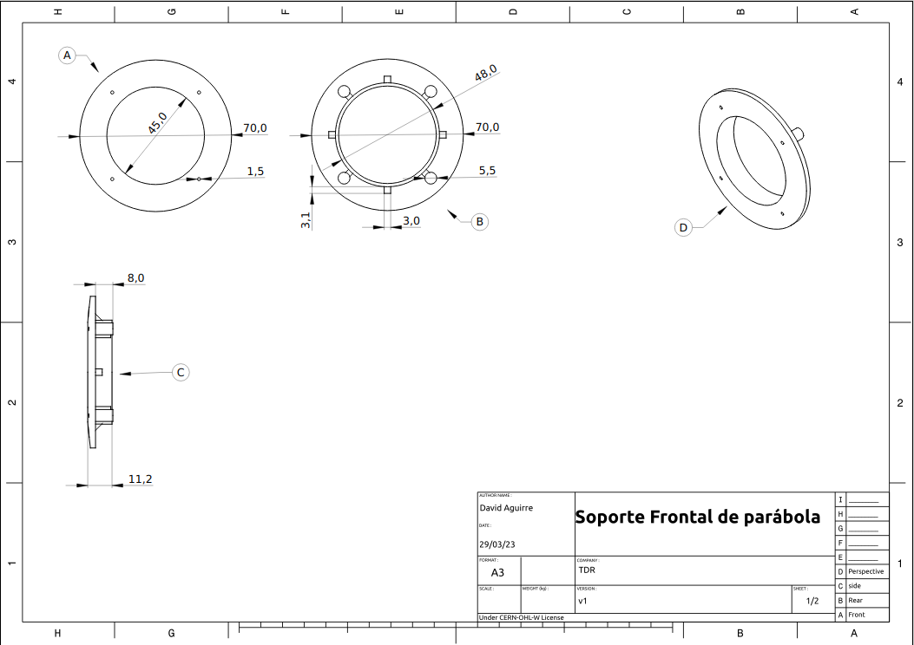
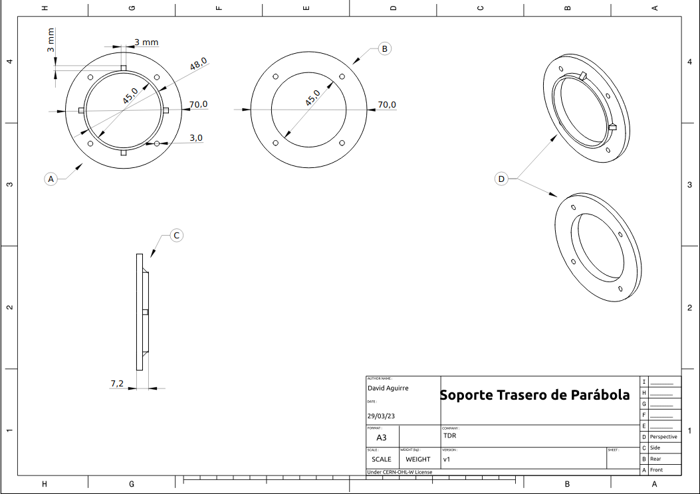

___

This project was funded through the <strong> <a href="https://nlnet.nl/useroperated/">User-Operated Internet</a> </strong> fund, a fund established by <a href="https://nlnet.nl">NLnet</a> made possible by financial support from the <a href="https://pkt.cash" rel="nofollow">PKT Community</a> <a href="https://pkt.cash/network-steward" rel="nofollow">The Network Steward</a> and stichting <a href="https://technologycommons.org">Technology Commons Trust</a>.
 

En cooperación con <a href="https://altermundi.net/">AlterMundi.</a>

