<!--
SPDX-FileCopyrightText: 2023 Tecnología de Raíz <tecnologiaderaiz@disroot.org>

SPDX-License-Identifier: CC-BY-NC-4.0
-->

# Workspace description

The physical space in which we work is a 3.5m x 4m room, where we have two work tables:    

* One where we preparate the pipes and metal brackets.
* Another one where we have the device that holds the wires for welding.

 
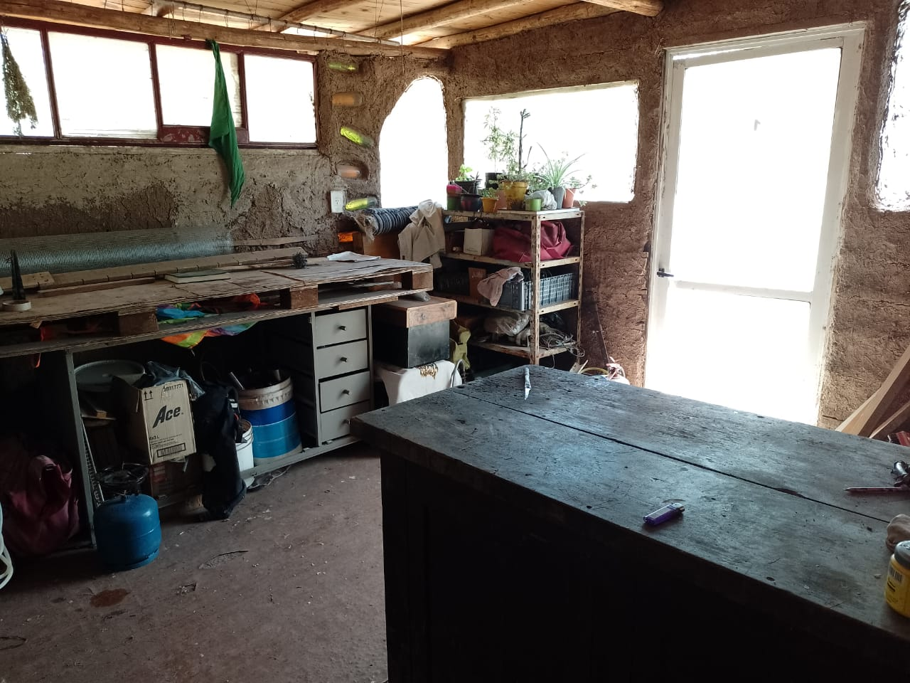
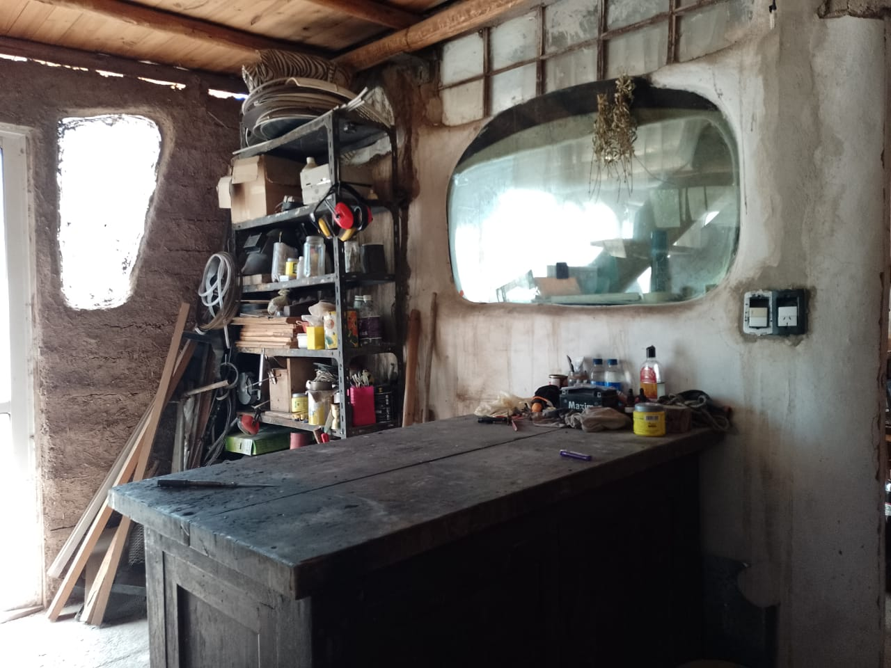

## Personal protective equipment:

* Hearing protectors
* Gloves
* Goggles
* Masks
* Work clothes

## Production process with advanced materials and tools

## Mark Metal Brackets

#### Workspace:

For this process we use a table and a wooden block that helps us to make the marking with a custom-made template and then drill the  <a href="https://github.com/TecnologiadeRaiz/LoPALiR/blob/main/Plano%20Soporte-v3.svg">metal brackets.</a>

#### For this process we need:    

* Firm table
* Wooden block
* Perforation template
* 2mm thick metal sheet of 50mm x 80mm with a 90º fold of 50mm x 50mm
* Marking point
* Hammer 

#### How to do it?

We use the work table with a wooden block that holds the metal plate to mark it, supporting the template to make the perforations on it.

With the help of the template we proceed to mark the plate with a marking point and hammer.

If you do not have the resources to create such a template, please visit the following <a href="https://github.com/TecnologiadeRaiz/LoPALiR/blob/main/Marking%20supports.pdf">link.</a>

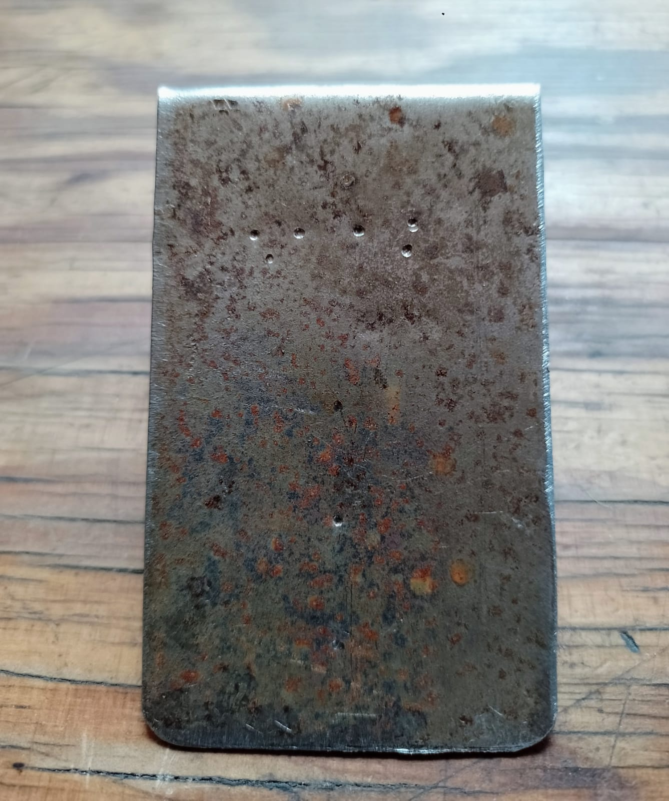

#### Recommendations:

To avoid problems with the alignment of the antennas it is necessary that the template is aligned with the bracket.

## Drilling of metal brackets

#### Workspace:

We use the central work table with the bench drill, and the template designed for this purpose.

#### For this process we need:  

* 6mm wick
* Round and flat file (to remove burrs)
* Bench drill
* Bench vise

#### How to do it?

With the metal plates marked, we proceed to drill them with the bench drill.
Once the holes have been drilled, we file off the burrs.

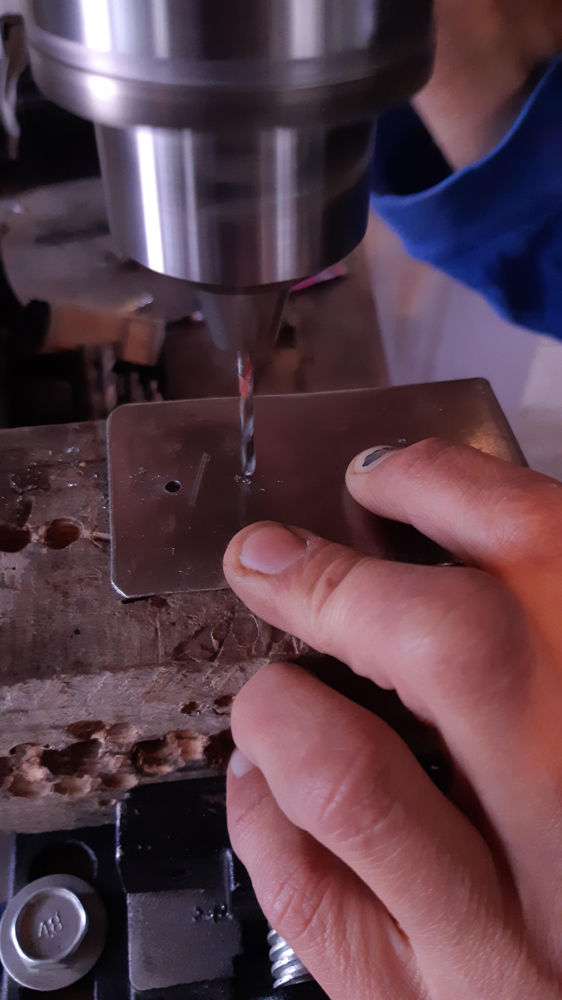
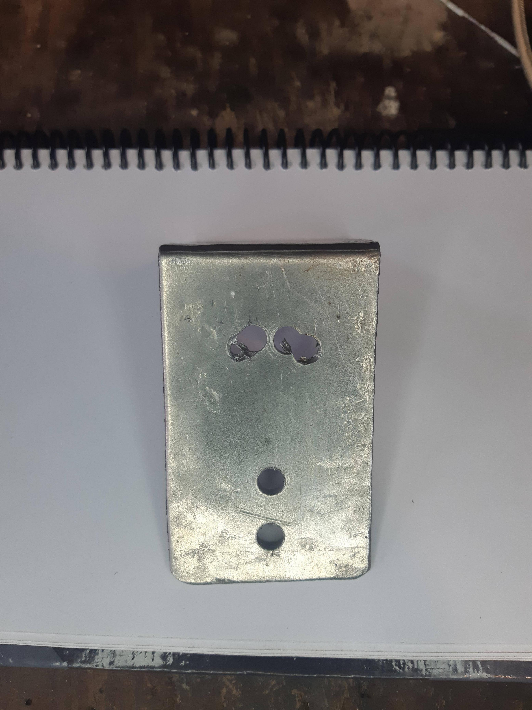

#### Recommendations:

It is advisable to use a wooden dowel that the drill bit can hold and allow the metal bracket to rest on it for drilling.
    
It is also advisable not to take too long when drilling to avoid damaging the drill bit, as it gets very hot due to friction. It is also recommended to use low speed when drilling metals.
    
If a bench drill is not available, the brackets can be drilled with a hand drill.

Drilling and tinning of the waveguide

#### Workspace:

For this task, we use the central workbench, with the bench drill.

#### For this process we need:   

* Bench drill
* Induction welder
* Tin

#### How to do it?

With the 130mm iron pipe we proceed to prepare the workbench to drill the waveguide.

With the help of the <a href="https://github.com/TecnologiadeRaiz/LoPALiR/blob/main/MOLDE%20DE%20PERFORACION%20GUIA%20DE%20ONDAS-v2.FCStd">drilling mold.</a>. 

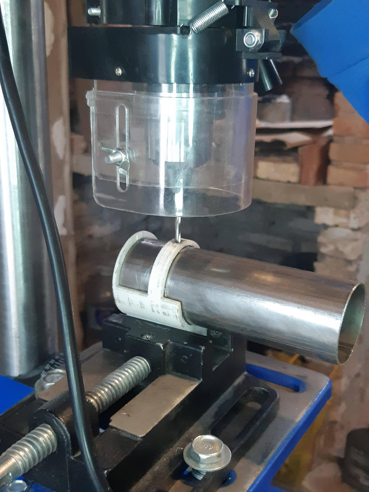

Once the pipe is drilled we tin around the holes.

If you do not have these tools, you can perform the procedure with other more basic tools. To find out how, visit the following <a href="https://github.com/TecnologiadeRaiz/LoPALiR/blob/main/Drilling%20and%20tinning%20of%20waveguide%20holes.pdf">link</a>
   

#### Recommendations:

    
It is important that the holes in the waveguide are aligned with the holes in the bracket, as this will affect the alignment of the antenna.

## Trimming edges to give circular shape to the metal bracket

#### Workspace:

We use the central table of the workspace.

#### For this process we need:  

* Veneer cutter
* Lime

#### How to do it?

The waveguide pipe is used as a template to mark the brackets.
Then with the sheet metal cutter, following the marks, the rounded shape is given.

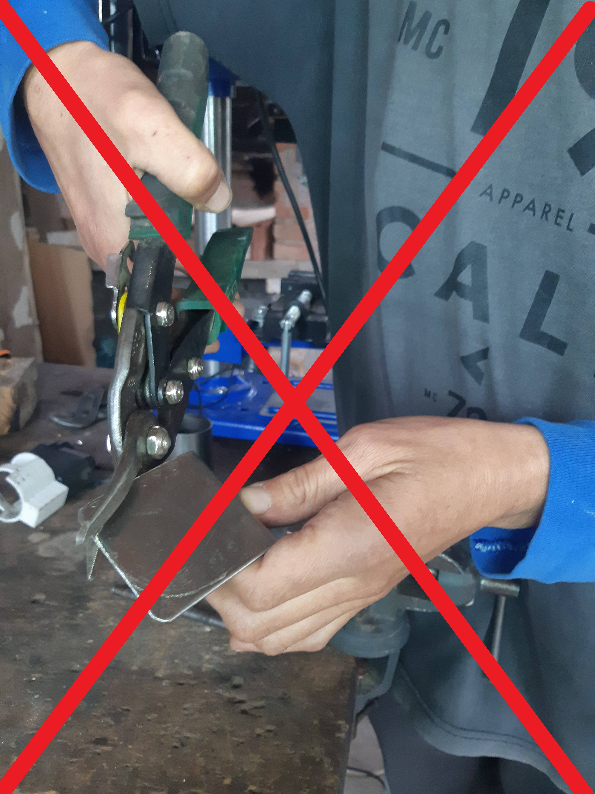
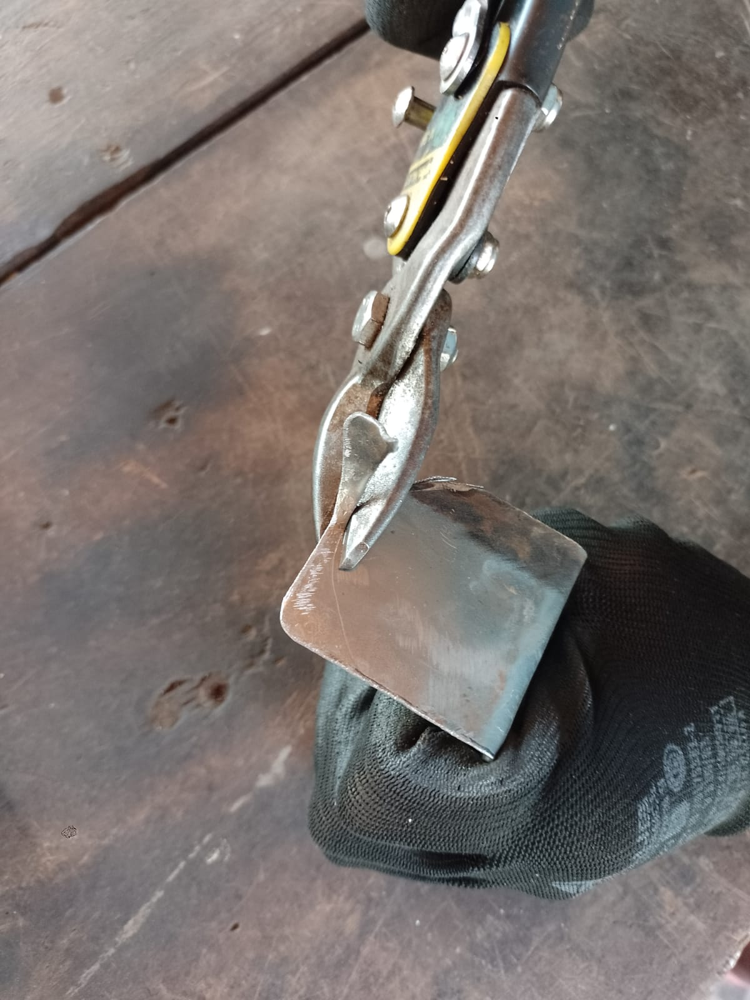
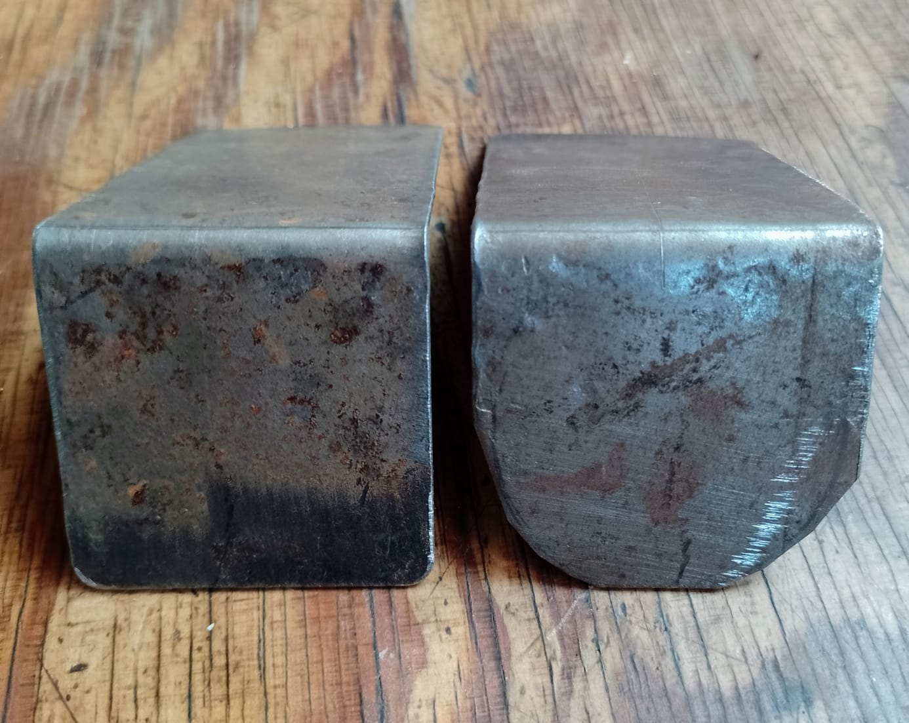

#### Recommendations:

Use personal safety elements, in this case gloves.

## Welding brackets

#### Workspace:

We use the work table, with a plate to protect the table from sparks falling during welding.

#### For this process we need:  

* Sheet metal
* Inverter welder
* Electrodes E-6013 (or compatible)
* Bench vise
* Pipe and bracket
* Welding or leather gloves
* Protective mask

#### How to do it?

With the bracket clamped to the mortise by its perforated side, we place the waveguide with the perforations facing downwards and one of them facing the rounded side of the bracket.

#### Recommendations:

It is very important to use eye protection, the masks used must be appropriate for electric welders.
    

## Grinding and puttying

#### Workspace:

We use the central table of the workshop with the bench vise in place.

#### For this process we need:  

* Bench vise
* Grinder
* Grinding disc
* Waveguide with welded brackets

#### How to do it?

Holding the waveguide firmly with the clamp, we remove the excess solder from the bracket and the waveguide.

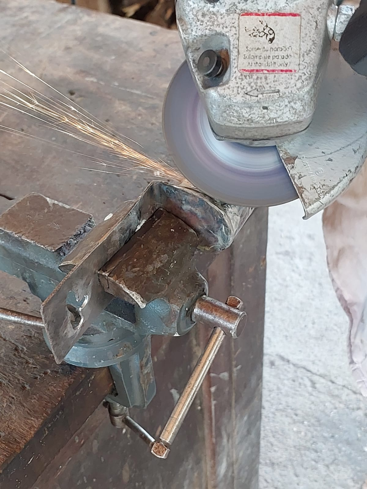

#### Cautions:

    
Use personal protection elements, in this case glasses, gloves, hearing protection and work clothes that cover the whole body, so that the metal shavings do not harm us. Also, work with the corresponding ventilation.

## Antenna painting

#### Workspace:

The painting machine is used in a spray booth or outdoors, since the working space inside the workspace is very small, and the machine sprays a large amount of paint.

#### For this process we need:   

* High resistance synthetic paint.
* Painting machine.
* Diluent.

#### How to do it?

To use the machine for painting, the paint must first be diluted so that it is sufficiently liquid to be sprayed by the machine.
For drying, we use a hanging device where they can remain for the necessary time, without hindering the work in the rest of the workshop, until the drying process is finished.

In case you do not have a painting machine, this procedure can be done with a brush.

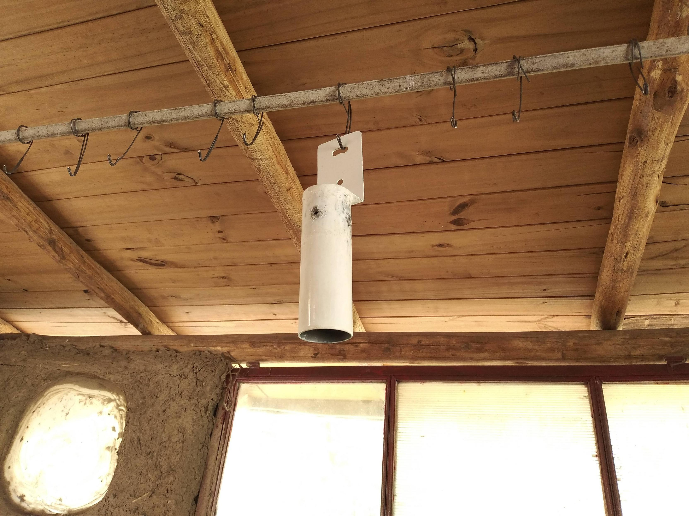

## Pigtail cable assembly

#### Workspace:

This part of the production is carried out on a table free of metal filings or shavings.

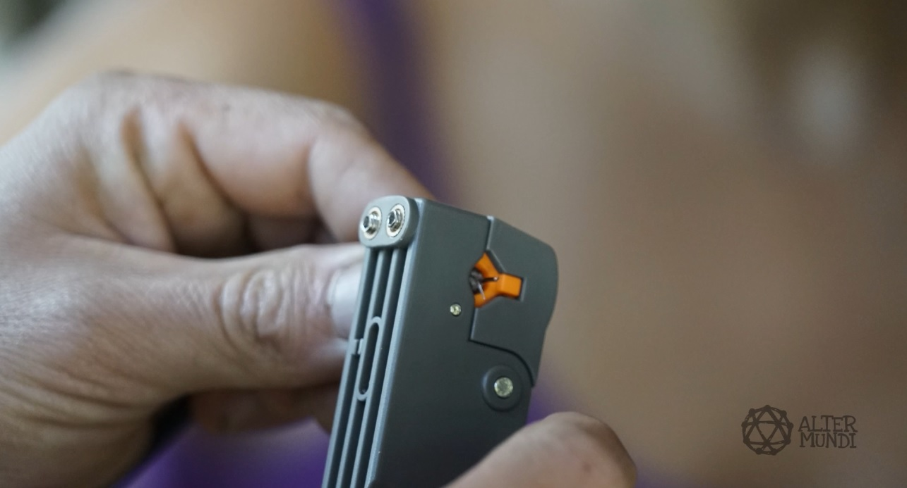
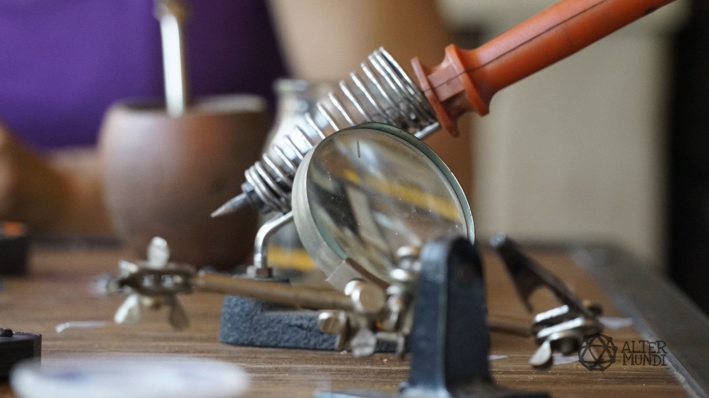

We fit the SMA RP male connectors

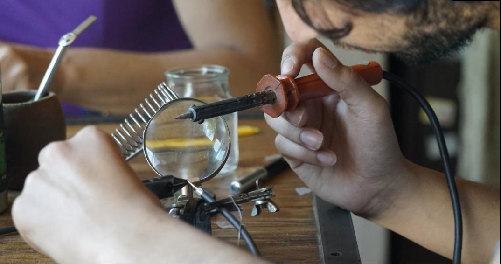
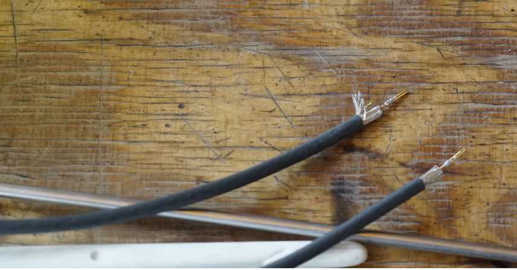

To show how the process works, we share these explainer videos:

* <a href="https://player.vimeo.com/video/780569067?h=7d256afc33">Assembly part 1</a>

* <a href="https://player.vimeo.com/video/780568264?h=076a3a0531">Assembly part 2</a>

To complete the process, they are crimped and heat-shrunk. 

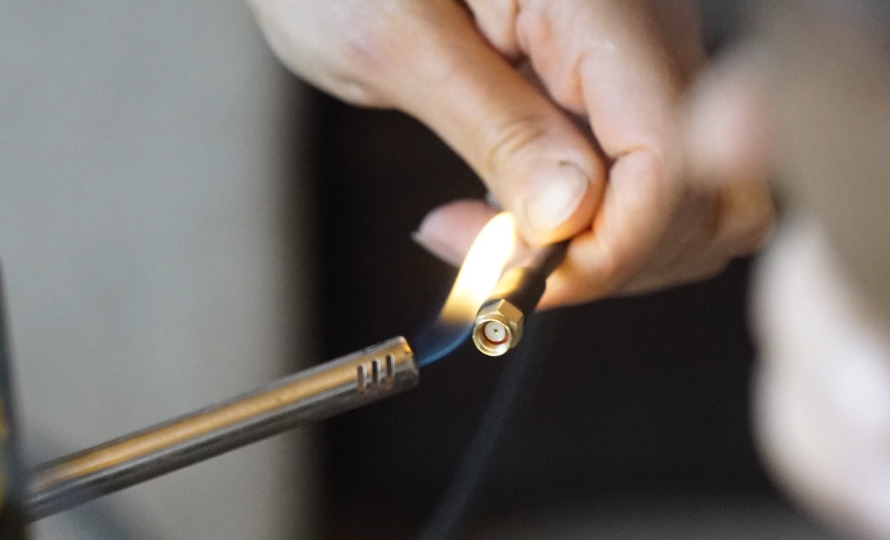

At the other end of the wire, we strip the sheath to obtain the pin that will illuminate the waveguide.
We recommend an 11.7mm long pin.

## Solder wires to the pipe

#### Workspace:

This process can be performed on the auxiliary workbench, where we have installed a device with slots to hold the cables. 

#### For this process we need:  

* Tin
* Vesuvius welder
* 5mm (3/8") segment of 8mm (3/8") aluminum pipe
* Pigtail cable x2

#### How to do it?

We tin the perforations previously brushed, then we take the pigtail cable, place it in the perforation and solder the mesh to the pipe (waveguide).

>* If you do not have a Vesuvius welder, this work can be carried out with a Zinguero welder.

#### Recommendations:

We must make sure that the soldering iron is very hot and clean, in order to minimize the contact time and thus not burn the cable sheath.

## Portachains rings printing

#### Workspace:

We use a piece of furniture where the 3D printer is positioned, sheltered from the hostility of the workshop.

#### For this process we need: 

* Designs made in Freecad

* 3D Printer

* Petg Filament

#### How to do it?  

We laminate the designs (.stl) made in Freecad to obtain them in .gcode format in this case, we store them in a memory card that we insert in the 3D printer to print them.

## Fitting portachains rings

#### Workspace:

We use the auxiliary table to place the portachain.

#### For this process we need: 

* Portachain rings   

* Antenna with welded cables

* 3/8" aluminum pipe

#### How to do it?

The larger ring is inserted through the waveguide, until it reaches the place where the cable is located.
Then attach the rear carrier, using a 5mm segment of 3/8" aluminum pipe, passing it through the cable and bringing it up to the two carriers together, and crimping it to hold the cables securely.

## Testing

#### Workspace:

This work can be performed on the device created to hold the cables.

#### For this process we need: 

* <a href="https://github.com/TecnologiadeRaiz/LoPALiR/blob/main/About%20RC%20Antenna%20SWR%20Meter.pdf">RC Antenna SWR Meter.</a>

#### How to do it?

First of all, an visual inspection is carried out in order to arrange the two pins at 90 degrees.
Once this procedure is done, one of the wires is connected to the RC antenna meter and the waves emitted by that chain are measured first, and then those of the other one.

## Placing covers and finishing

#### For this process we need: 

* Plastic lid 

* Assembled waveguide

To protect the illuminators, the waveguide is closed with a plastic cover and silicone sealant to prevent leaks.

## Finished antenna    

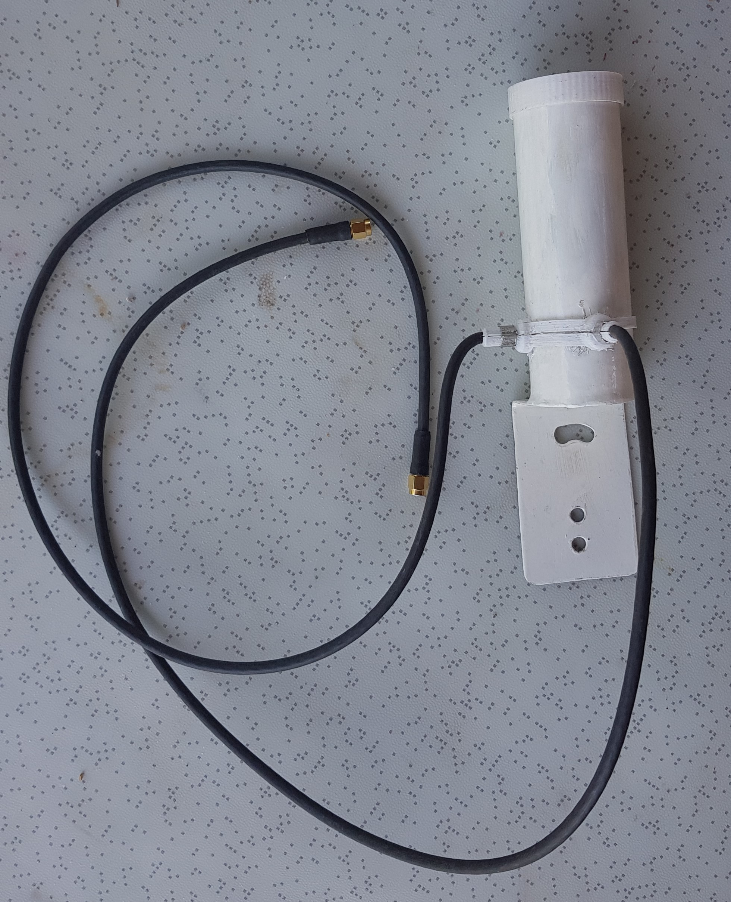

>!TDR is not responsible for possible damages caused by performing these procedures using this informative material.

___

This project was funded through the <strong> <a href="https://nlnet.nl/useroperated/">User-Operated Internet</a> </strong> fund, a fund established by <a href="https://nlnet.nl">NLnet</a> made possible by financial support from the <a href="https://pkt.cash" rel="nofollow">PKT Community</a> <a href="https://pkt.cash/network-steward" rel="nofollow">The Network Steward</a> and stichting <a href="https://technologycommons.org">Technology Commons Trust</a>.
 

Saludamos a les amigues de <a href="https://altermundi.net/">AlterMundi.</a>

