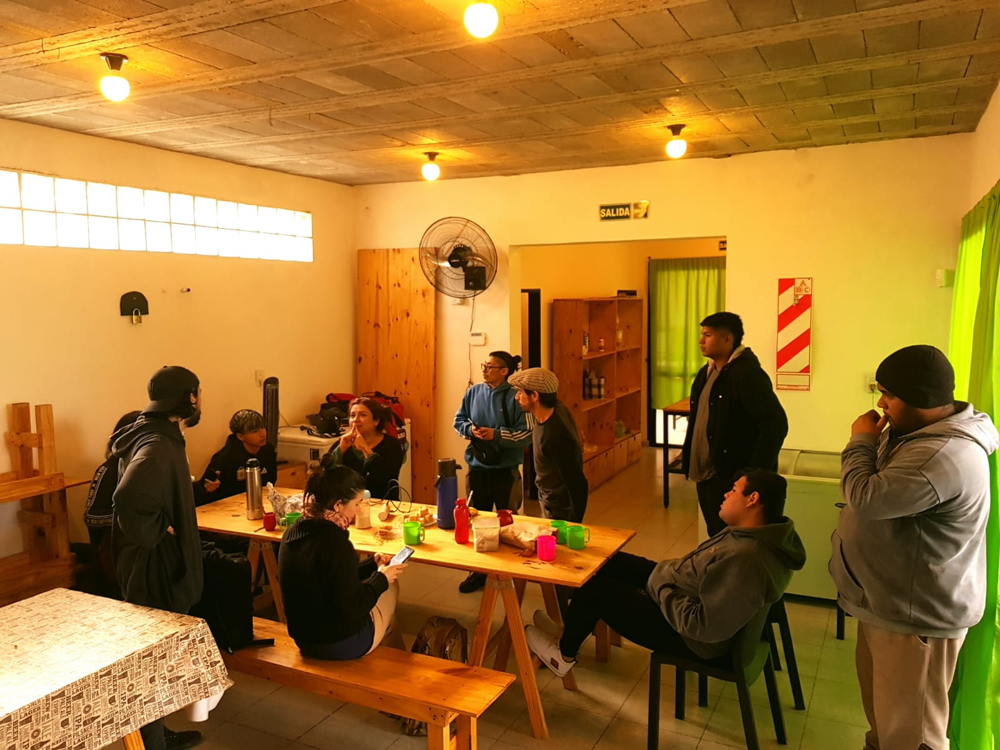

<!--
SPDX-FileCopyrightText: 2023 Tecnología de Raíz <tecnologiaderaiz@disroot.org>

SPDX-License-Identifier: CC-BY-NC-4.0
-->

# Field test.

## Intro

In this material we are going to share the experiences in which we worked in relation to the field tests of our antennas, telling about the programes and organizations and referencing those who took part in these processes. We consider these experiences to be very enriching for the groups that took part, as the articulation between organizations allows us to continue growing and learning. It also enables those who require it to deploy, expand and build inputs for community networks. One of these experiences is the ANERA project, in which AlterMundi promoted the participation, training and strengthening of a national programe of grants to community networks Roberto Arias - ENACOM. In the development of this successful project, several activities were carried out, such as a face-to-face meeting in which we delivered the antennas manufactured in the TdR workshop to several networks throughout the country.

This is also the case in India, where, thanks to the "Community of Practice" programe of the "Association for Progressive Communications" and the participation of the community of Janastu, exchanges of practices and methods of antenna production took place.

Similarly, the Colnodo community in Colombia adopted our design and manufacturing method, testing their first prototypes in laboratories at the Universidad Departamental de Bogotá.

Following these experiences and with the aim of carrying out field tests of the conical version of our antennas, we organized a visit to Campo de la Rivera, a popular neighborhood on the outskirts of the capital of Córdoba, where the residents created a community network to solve their connectivity problems, mainly related to the lack of resources to access the expensive services provided by telecommunications companies. There, members of the Encuentro de Organizaciones group installed 5 LibreRouter nodes with antennas built by TdR, which we replaced with conical antennas for field tests. In this part of the neighborhood, the community network and the TdR antennas provide connectivity to neighbors, as well as to a community space where there is a dining room, a picnic area and other activities that enrich the community work. There, we met in the community dining room, where we shared activities and they showed us how the network works in order to start the tests.

---

###

Resultados de las pruebas.

Primera prueba.

En primer lugar realizamos mediciones con las antenas que tenían instaladas en la red de Campo de la Rivera. Estas antenas, realizadas con el método de sujeción de cables de resina, dieron los siguientes resultados: 

### Test results.

#### First test.

First, we carried out measurements with the antennas that were installed in the Campo de la Rivera network. These antennas, carried out with the resin cable clamping method, gave the following results: 

Here we can see how this prototype does not solve the need, as the cables are not firmly attached, which negatively affects the performance of this prototype; the result of this inconvenience can be seen in the image where chain 2 has a lower signal level than chain 1.

After finishing the tests with the resin clamped prototype, we installed a conical version prototype which gave these results:

In this graph we can see that the antenna signal in its chain 1 reaches -54dB in the central channels. It is important to bear in mind that, in the graphs, the signal in dB is reflected vertically and the channels used horizontally. The different signal levels are not located equally in all the graphs shown, so in order to make a comparison between the performance of the different prototypes, we must always pay attention to the reference in dBs contained in each image.

---

#### Second test

Our next field test was carried out in the community network in our territory. Here MonteLibre allows 60 families from two neighboring villages to access communication.

This network, which already had waveguide antennas built in the TdR workshop, allowed us to carry out field tests between two of its main nodes located at a distance of 1.2 km.

We initially carried out measurements with the version 5 antennas, already installed and operating in the network, which gave these results:

In this test carried out with a power set at 25dB, 8 references are shown in the vertical direction, and a maximum performance of chain 1 at -68dB.

In this same scenario, where we have tested the previous prototypes, we placed the conical version and obtained these results:

In conclusion, we have found that the performance of the conical antennas is very good, and can improve connectivity compared to the other versions, as they provide higher gain using only slightly more material.

