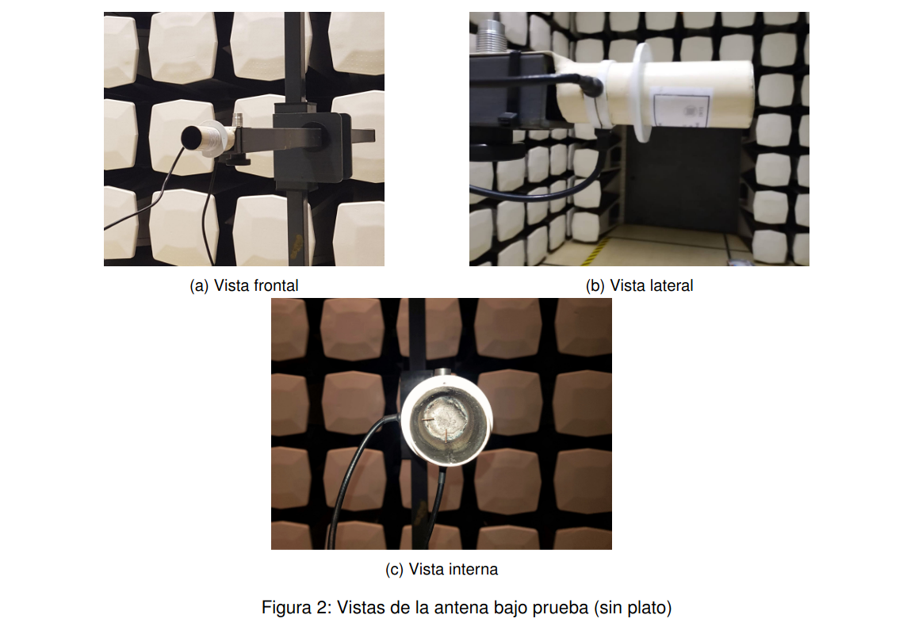
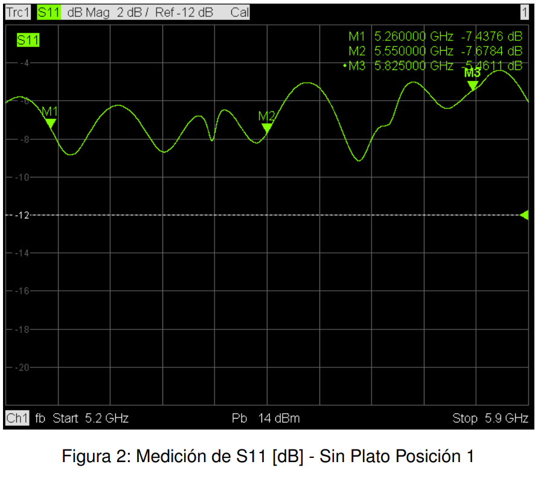
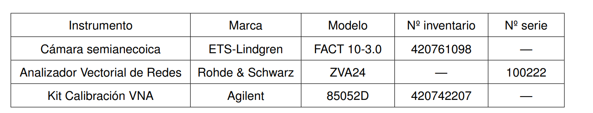

<!--
SPDX-FileCopyrightText: 2023 Tecnología de Raíz <tecnologiaderaiz@disroot.org>

SPDX-License-Identifier: CC-BY-NC-4.0
-->

# Characterization

After the prototyping stage was completed, as planned, we sent one of our models to the [INTI](https://www.argentina.gob.ar/inti) (National Institute of Industrial Technology) to perform a characterization of our sectoral antenna and also of the same antenna converted into a directional one using its accessories.

We are sharing an excerpt of the most relevant data from the report provided by the Communications Department of the INTI.

These images were taken in a semi-anechoic chamber, which allows testing without interference from acoustic or electromagnetic waves.

Through this test we obtained information that allows us to know with precision the characteristics of the antenna.

For both modes of the antenna (sectorial and directional) we requested the measurement of the radiation lobe in two polarizations at 3 specific frequency points:
 5260 MHz, 5550 MHz, 5825 MHz 

These were some of the results of the measurements obtained in the tests.

### Sectorial antenna radiation lobe

### Parameter s11 sector antenna

### Parameter s21 directional antenna

### Directional antenna radiation lobe

### Parameter s11 directional antenna

### Parameter s21 directional antenna

### We share the table of instruments used for the tests.
Instruments used in the measurement of parameters s11 and s21

Instrumentation used to make radiation diagrams

### To summarize:

#### Sectoral antenna characterization:

Maximum gain: 7 dBi

Horizontal beamwidth: 60 degrees

#### Directional antenna characterization with accessories:

Maximum gain: 18 dBi

Horizontal beamwidth: 10 degrees

These results demonstrate a significant improvement in gain and directivity when using the corresponding accessories

Full report in this [link](https://github.com/TecnologiadeRaiz/LoPALiR/blob/main/INFORME%20Waveguide%20INTI.pdf)
