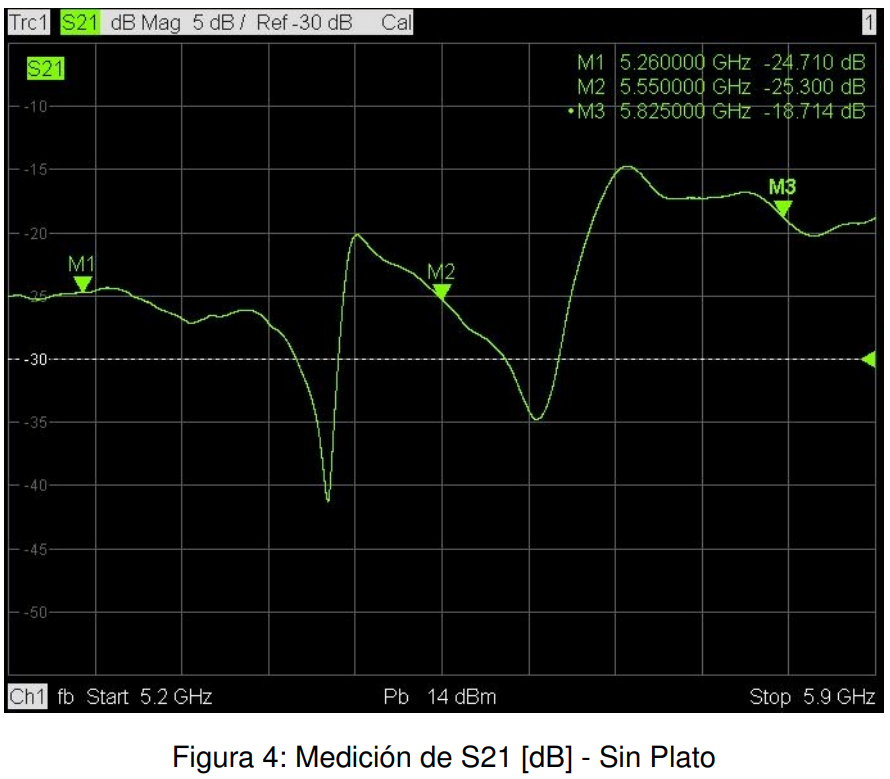

<!--
SPDX-FileCopyrightText: 2023 Tecnología de Raíz <tecnologiaderaiz@disroot.org>

SPDX-License-Identifier: CC-BY-NC-4.0
-->

# Characterization

After finishing the prototyping stage, as planned, we sent one of our models to [INTI](https://www.argentina.gob.ar/inti) (National Institute of Industrial Technology) to perform a characterization of our sectorial antenna and also of it converted into directional antenna by means of its accessories.

We share some data of the report delivered by the communications department of INTI.

These images were taken in a semi-anechoic chamber, which allows testing without interference from acoustic or electromagnetic waves.

Through this test we obtained information that allows us to know with precision the characteristics of the antenna.

For both modes of the antenna (sectorial and directional) we requested the measurement of the radiation lobe in two polarizations at 3 specific frequency points.

These were some of the results of the measurements obtained in the tests.

### Sectorial antenna radiation lobe

### Parameter s11 sector antenna

### Parameter s21 directional antenna

### Directional antenna radiation lobe

### Parameter s11 directional antenna

### Parameter s21 directional antenna

### We share the table of instruments used for the tests.
Instruments used in the measurement of parameters s11 and s21

Instrumentation used to make radiation diagrams

Full report in this [link](https://github.com/TecnologiadeRaiz/LoPALiR/blob/main/INFORME%20Waveguide%20INTI.pdf)
