<!--
SPDX-FileCopyrightText: 2023 Tecnología de Raíz <tecnologiaderaiz@disroot.org>

SPDX-License-Identifier: CC-BY-NC-4.0
-->

# Tecnología De Raíz

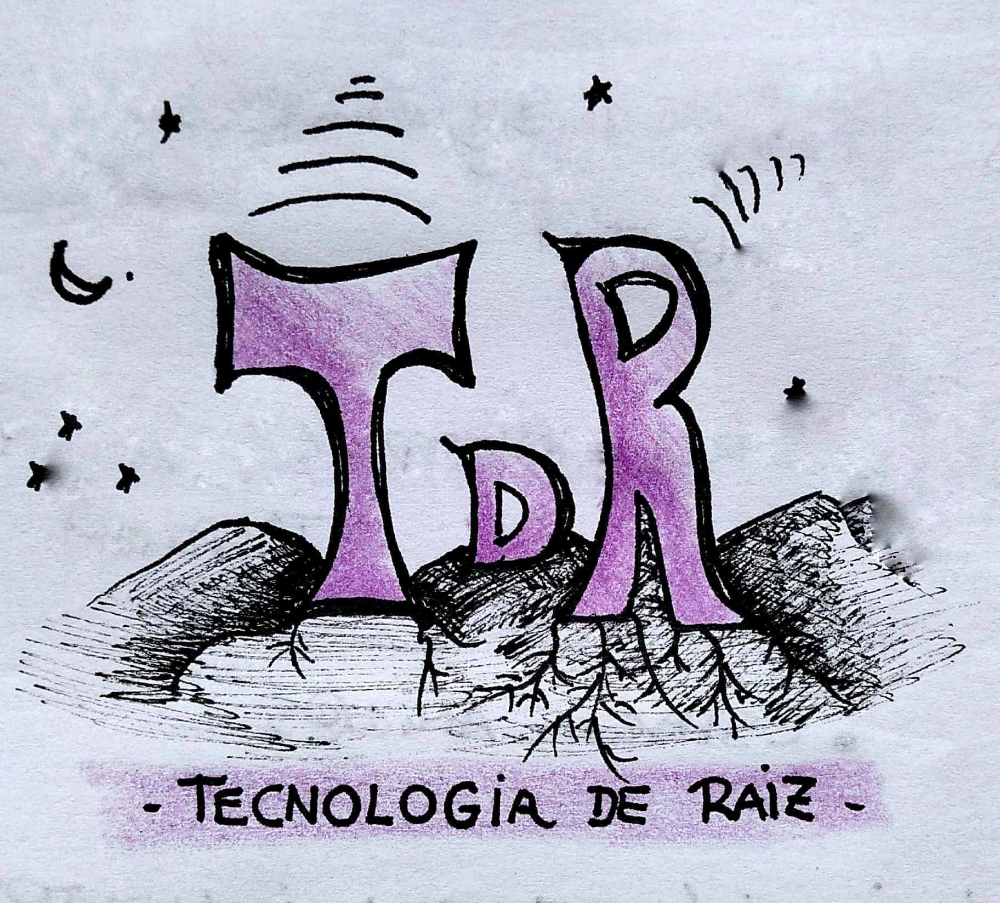

## We are TdR

Neighbors of the Ecological Neighborhood "El Montecito" located in Punilla Valley (Córdoba, Argentina)

We formed a study and research group, wherein we created a space to work and study together, and we have sustained it continuously since mid-2019.

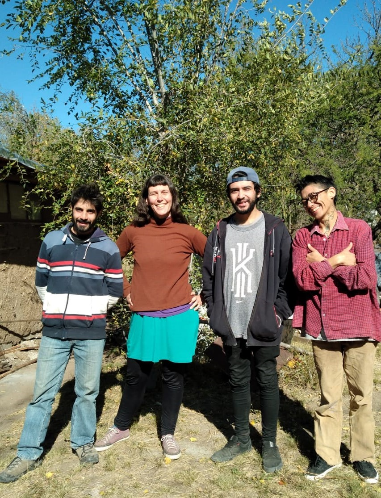

We start from curiosity and interest in sharing information about electricity, electronics, technology and the right to repairs. 
Going that way, the MonteNet network was simultaneously deployed in our neighborhood, and we began to learn about community networks.

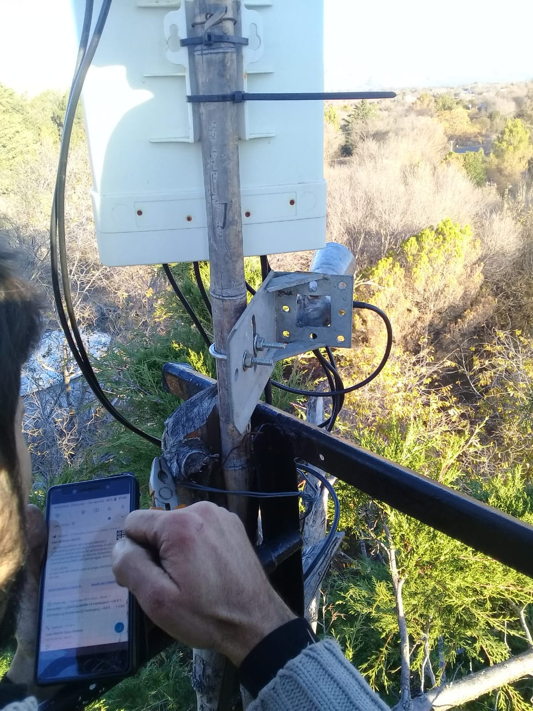

We focus our interest on the research and development of antennas.

By forming ourselves as a working group, our search is:

* Generate an antenna prototype that can be easily reproduced.
* Generate a work group with a gender perspective where, through communication, we strengthen our ties and thus build a harmonious work space.
* Develop our enterprise for productive purposes, so that it allows us to generate income.

For this, we use a workshop space with a limited number of tools, which allow us to develop our production, but we would like to be able to improve it, both in terms of construction and adding machines and tools

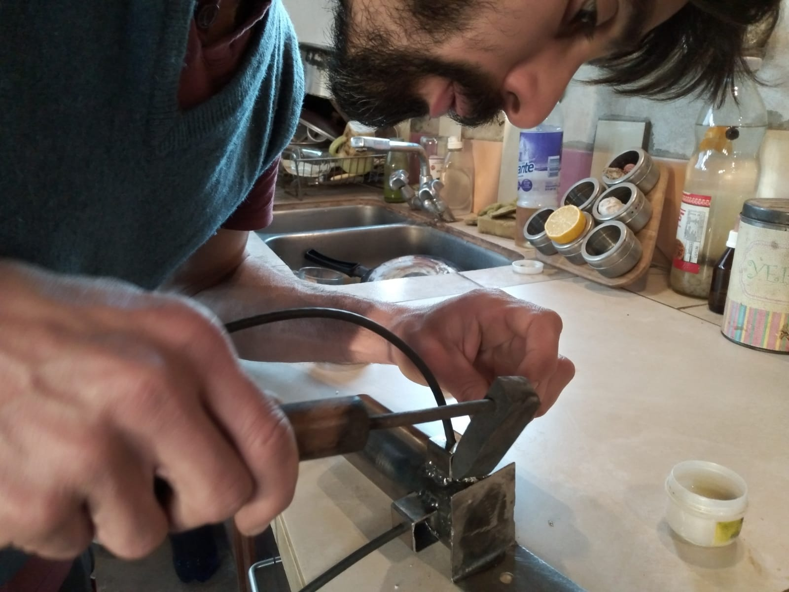
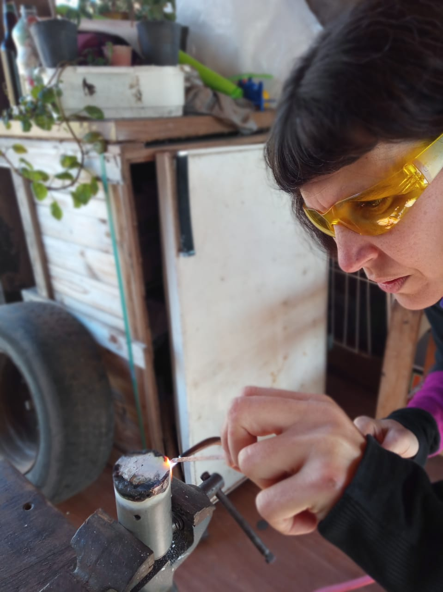
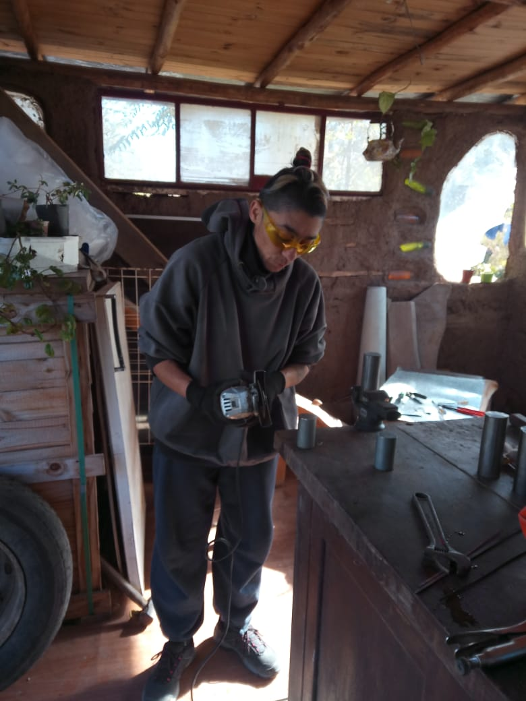
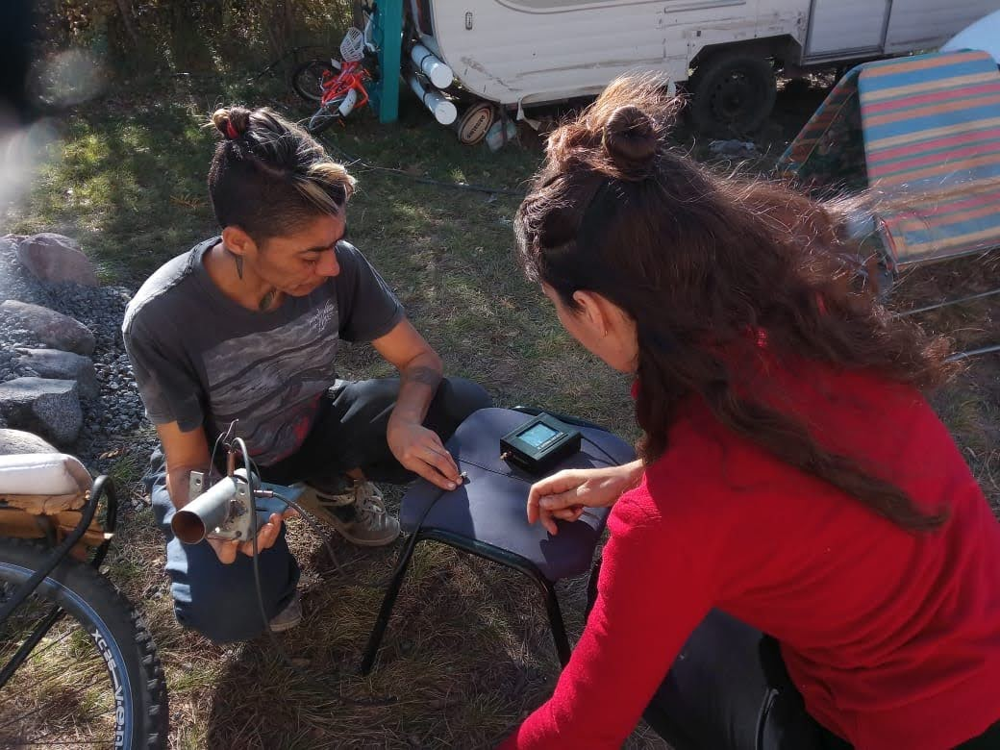

We started the research path by building double biquad antennas.

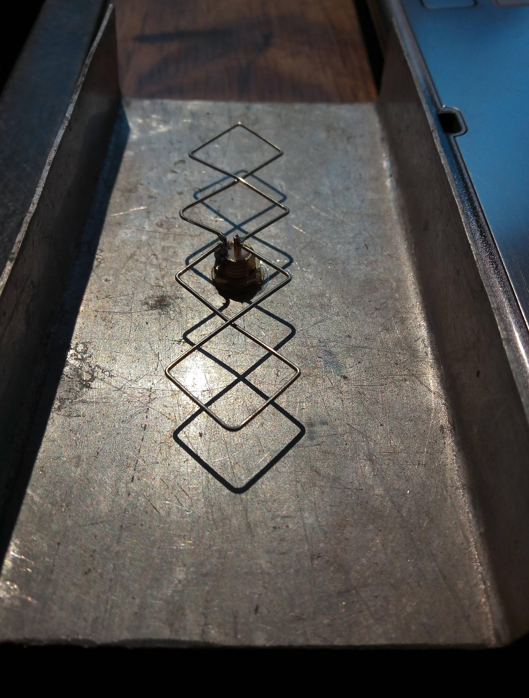
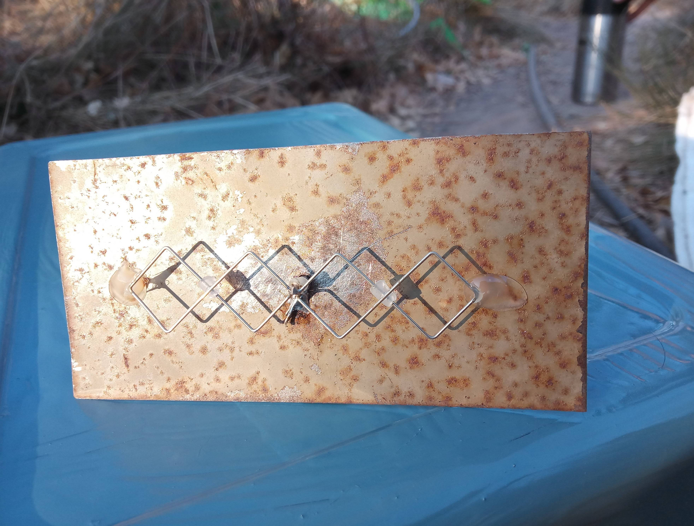
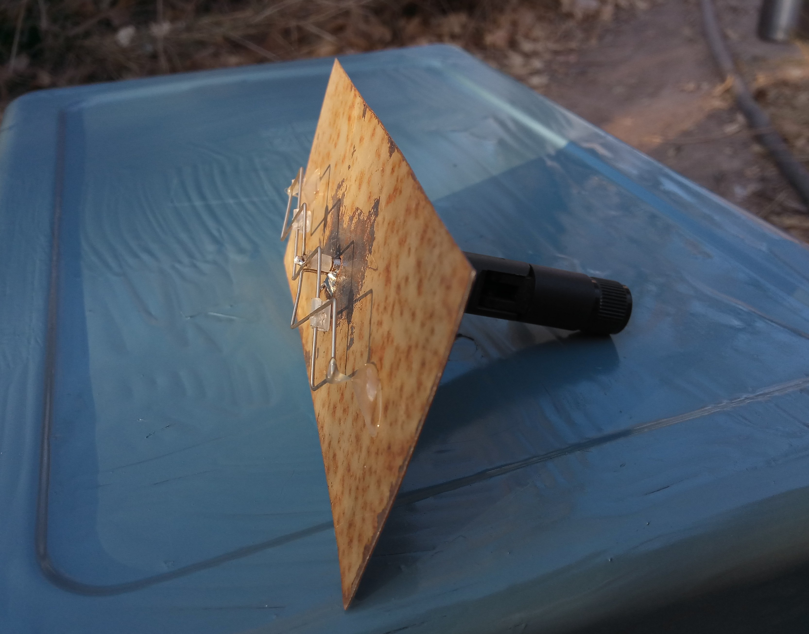
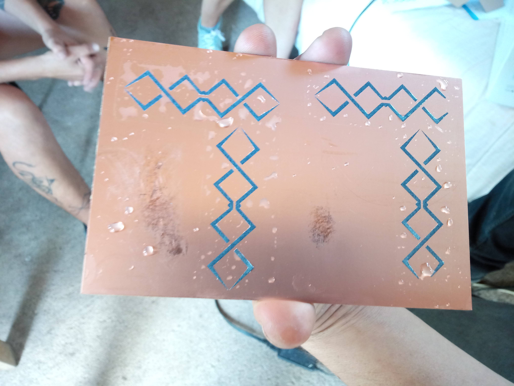
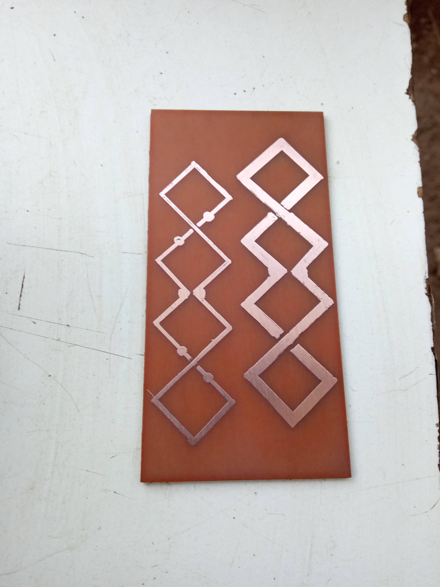
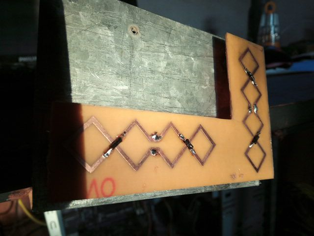

Some of which are installed in the MonteNet network, helping to improve the link between nodes.

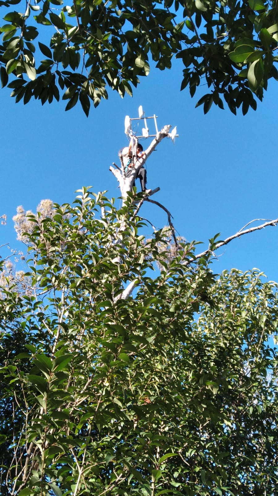

We have built some [waveguides](https://tdr.libre.org.ar/paso-a-paso-sectorial/) for the community networks in our territory, and we are working on a productive enterprise with them, responding to the needs of the networks, trying to create an efficient, low-cost, locally produced product.

### On that path, we encountered some difficulties:

* The tools we have do not allow us much precision, we need to work even more in the workshop space to optimize the work.

* The tests we carried out were measured with a program that was developed for this purpose, but it took us quite a few attempts to adapt it and use it optimally.
 
* The stage for the tests has many variables, in addition to being shared with other people in the community and at height.

### For some time now, we have been working on these tasks:

* Research and production of functional antenna prototypes for community communication networks.

* LibreRouters logistics, reception, testing and shipments nationwide.

*  Review of mails -orders and inquiries about LibreRouters-

* Accompaniment and technical assistance in the MonteNet network.

* Support and promotion of community networks in the area

>i We are motivated to share empowering knowledge that facilitates technological appropriation, and that is why we work on registering our production processes, in order to share them.

---
### Links to LoPALiR project content:
 
* [How to make a design of a sector antenna](2-step-by-step-sectorial.md){step}

* [Waveguide support design](3-waveguide-support.md){step}

* [Directional antenna design](4-directional-antenna-design.md){step}

* [Waveguide and workspace](5-waveguide-and-workspace.md){step}

* [Prototyping](6-waveguide-prototype.md){step}

* [Plastic parts](7-plastic-parts.md){step}

* [Caracterization](Caracterization.md){step}

* [Field test](9-Field-test.md){step}

* [.](downloadable_instructions.md){step}